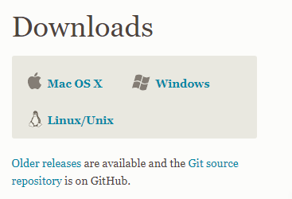
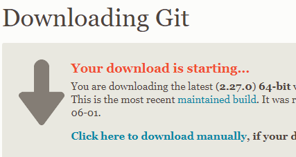
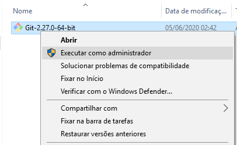
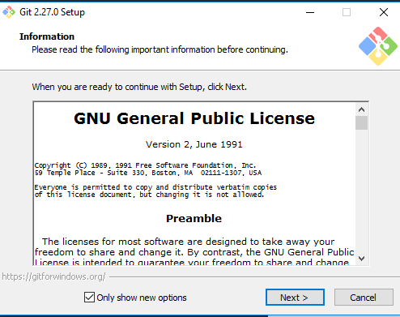
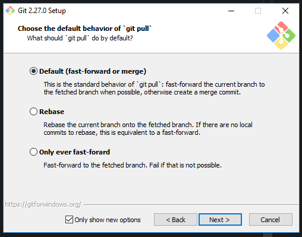
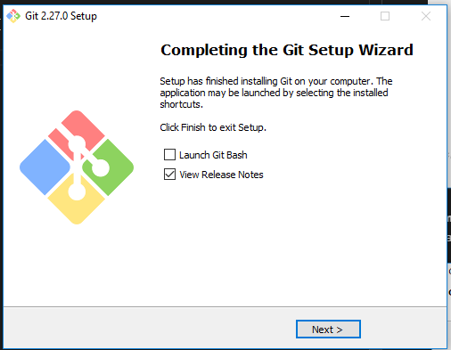
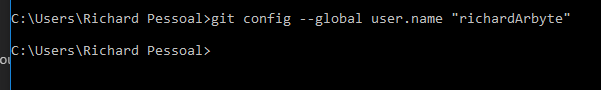
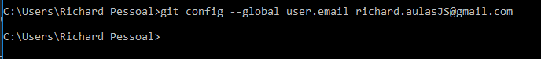
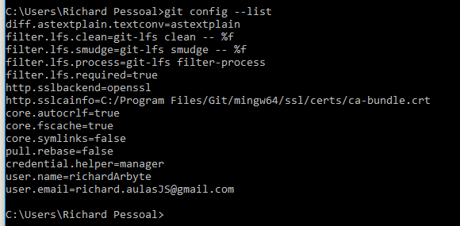

# GIT

Git é um sistema de controle de versão distribuído e um sistema de gerenciamento de código fonte, com ênfase em velocidade.

O Git foi inicialmente projetado e desenvolvido para o desenvolvimento do kernel Linux, mas foi adotado por muitos outros projetos.

# INSTALAÇÃO
Bora lá, a primeira coisa que você vai fazer é [acessar aqui](https://git-scm.com/downloads) e selecionar o seu sistema operacional.

Caso seu download não inicie imediatamente, basta selecionar `Click here to download manually`.

Feito o download, vamos começar a instalação.

Basta ir até onde o arquivo foi baixado e executa-lo (Se possivel, execute-o como administrador do sistema. No windows, basta clicar com o botão direito em cima do arquivo, e selecionar `executar como administrador`) 

Após isso, o instalador irá abrir, basta prosseguir clicando em `next`.

**Sempre** selecionando `next` e mantendo as configurações default.

E continue selecionando `next` até chegar na tela abaixo:

Pronto.

Para validarmos a instlação, abra o terminal do seu computador e digite `git --version`. Se aparecer a frase `git version XXXX`, significa que a instalação esta correta.

# CONFIGURAÇÃO

Feito a instalação, vamos configura-lo com as credênciais do github, caso não tenha conta [clique aqui](./github.md).

Primeiro, abra seu terminal, digite `git config --global user.name "USER NAME DO GITHUB"` e aperte ENTER.

Em seguida, digite `git config --global user.email EMAIL@CADASTRADO-NO-GITHUB.COM` e aperte ENTER.

Para validar suas mudanças, digite `git config --list`.

Pronto, seu git esta configurado corretamente.

Para entender mais sobre o git e suas demais configurações, [clique aqui](https://git-scm.com/book/en/v2/Getting-Started-First-Time-Git-Setup#:~:text=Checking%20Your%20Settings,.name%3DJohn%20Doe%20user.).

Achou algo faltando aqui? Abre um PR e ajude a manter essa documentação viva :)