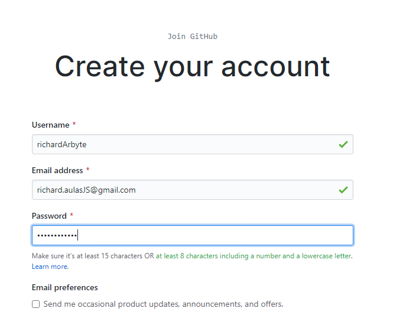
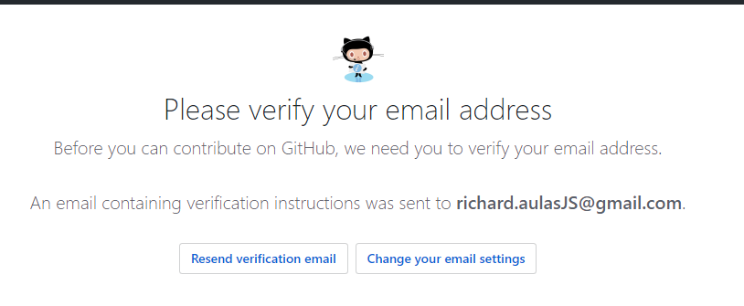

# GITHUB

O GitHub é um sistema de gerenciamento de projetos e versões de códigos assim como uma plataforma de rede social criado para desenvolvedores. 

Ele utiliza o git, então sempre reforçando, se não possui o git instalado em sua maquina, [clique aqui](./git.md), porque mais para frente vamos utiliza-lo.

# CRIANDO UMA NOVA CONTA
1 - Bora lá, a primeira coisa que você vai fazer é [acessar aqui](https://github.com/) e selecionar `sign up`.

2 - Depois disso será direcionado para tela de criação onde terá que escolher um username, preencher seu e-mail, definir uma senha e proseguir.

3 - Feito isto, será directionado para tela de Bem Vindo do github.

4 - Basta selecionar que é estudante e prosseguir até cair na tela de verificação de e-mail.

5 - Vá até seu e-mail cadastrado, você receberá um e-mail do Github, abra-o e clique em verificar e-mail.

6 - Após isto você será redirecionado novamente para o github, para uma tela com a seguinte mensagem:

Pronto, seu perfil no github está criado.

Achou algo faltando aqui? Abre um PR e ajude a manter essa documentação viva :)