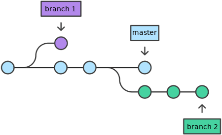
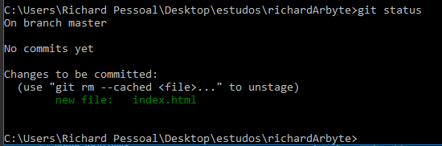
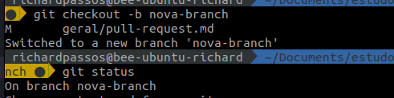
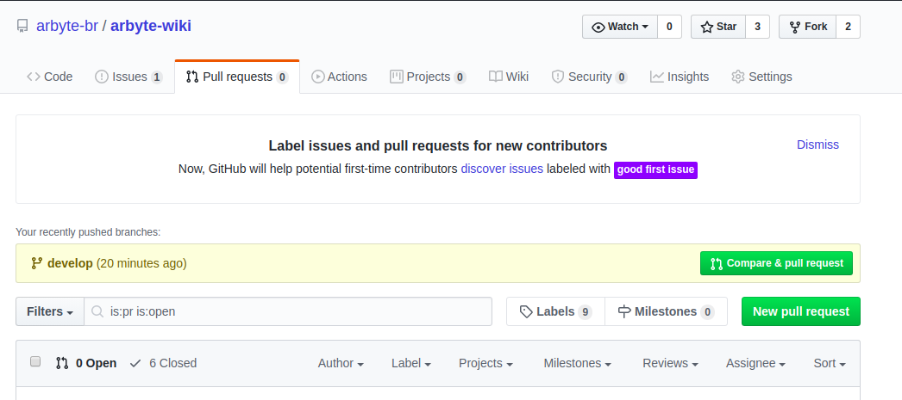
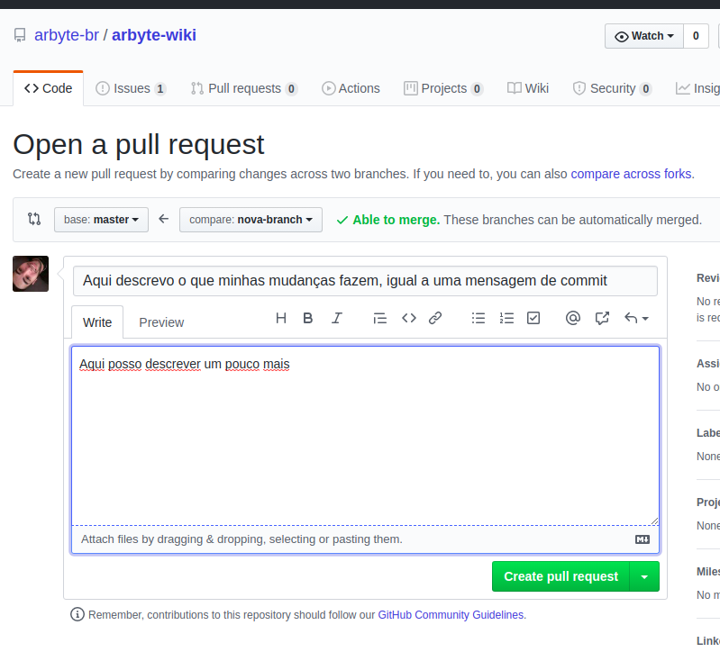
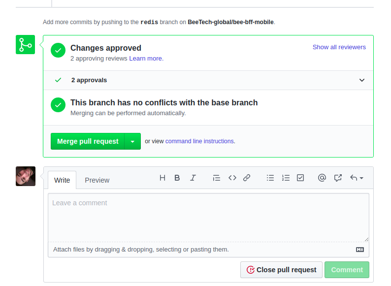
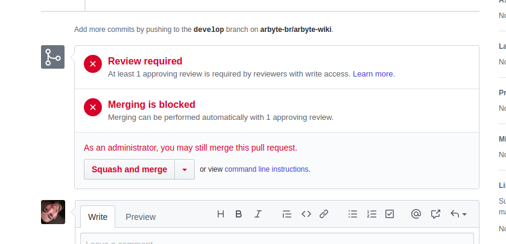

# PULL REQUEST

Para abrirmos um pull request, primeiro temos que entender o conceito de branchs do git, então vamos a uma breve explicação.

O git é representado como uma árvore, seus galhos chamamos de branchs, são extensões de seu galho de origem.

Essa é a representação visual da árvore do GIT.

Vamos aprender na prática, dentro do nosso repositório git, podemos ver em qual branch estamos rodando o comando `git status`.

Veja que é printado a frase `On Branch master`. O git está nos informando que estamos na branch `master`.

Digite o comando `git checkout -b nova-branch`.

Observe o que foi printado `Switched to a new branch nova-branch`, o git está nos informando que criou uma branch nova, com o nome `nova-branch`, em seguida nos direcionou para dentro dela.

Rode o comando `git status` novamente, observe que agora será impresso `On branch nova-branch`.

Estamos em uma branch que foi `estendida` da branch `master`, o que fazermos nessa branch, não impactará nosso galho principal, portanto, podemos fazer todas modificações dentro dela e commitar normalmente.

Vamos testar? Faça qualquer mudança em um arquivo e vamos comita-lo com os comandos:
blockquote>
 > `git add .`
 >
 > `git commit -m "minha mensagem"`
 >
 > `git push origin nova-branch`

Observe que estou dando um push escrevendo para onde quero enviar as mudanças, no caso, para a "nova-branch".

Pronto, vimos por cima como funciona uma branch, agora vamos fazer um Pull Request para master?

1.  Abra seu Github, vá até seu repositório e selecione `PULL REQUESTS`. Clique no botão verde `NEW PULL REQUEST`.

    ···

2. Nesta tela, na seção `compare` selecione a `nova-branch`, exatamente igual a imagem abaixo:

    Observe do lado da `nova-branch` uma seta apontando para onde estamos enviando nossas alterações, no caso, para a `master`.
    Também podemos ver a frase `ABLE TO MERGE` nos informando que a branch esta apta para ser mergeada -> merge é uma palavra inglesa que significa `fundir`, ou seja, mergear é o mesmo que fundir suas mudanças com a branch principal.

    Em seguida fazemos alguma descrição e clicamos em `CREATE PULL REQUEST`.
    
    ···

3. Se tudo deu certo, irá aparecer uma mensagem similar a esta:

    Se você clicar em `Merge Pull Request`, as mudanças que você fez em sua branch irão automaticamente para a branch `master`.

    ···

4. Caso você esteja abrindo seu pull request para um repositório que você não seja o dono, provavelmente irá receber uma mensagem similar a está:

    Basta esperar o dono do repositório avaliar seu pull request e mergear.

    ···

### Simples não? 

Conta pra gente o que achou, abrindo um Pull Request para esse repositório com seu feeback ;)
