# CRIANDO REPOSITÓRIOS NO GITHUB

## [SETUP](./glossario.md):
* Está com o git instalado e configurado? Se não  [cliquei aqui](./git.md).
* Possui conta no github? Se não  [cliquei aqui](./github.md).
* Instale o vscode caso ainda não o tenha, [clicando aqui](https://code.visualstudio.com/).

Pronto, agora que nosso ambiente está configurado, vamos começar a criar nossos repositórios.

Existem duas maneiras de criar, pelo github e pelo git, vamos fazer as duas.

# CRIANDO REPOSITÓRIO PELO GITHUB

1 - Dentro do github, clique no icone do seu peril e selecione `Your Repositories` ou `Seus repositórios`, caso esteja em português.

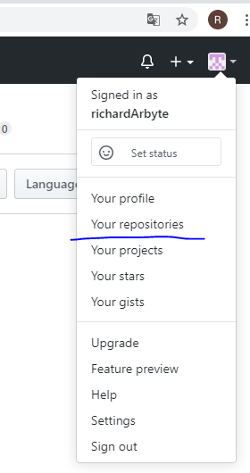


2 - Você será direcionado para tela abaixo, basta clicar em new/novo.
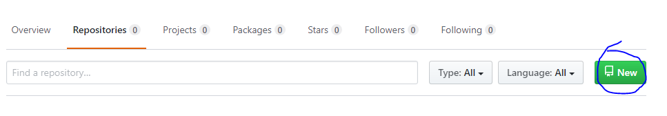

3 - Nesta tela, basta dar o nome que desejar para seu novo repositório, fazer uma breve descrição sobre o que aquele repositório se trata, caso queira, após isto, basta clicar em `Create Repository/ Criar Repositório`.

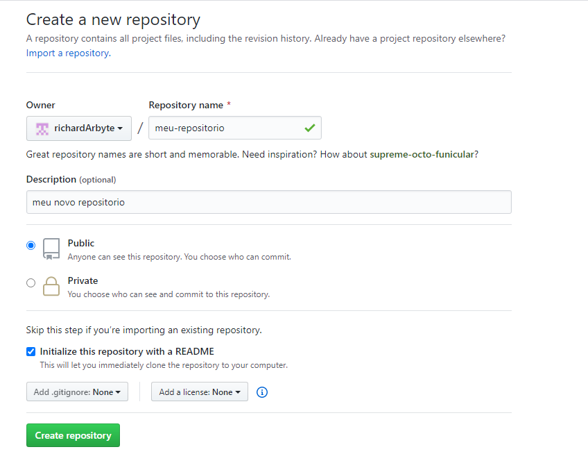

Pronto, seu repositório foi criado.

Assim que você cria seu repositório, o github te direciona para dentro dele. Se você clicar no botão verde a direita `Clone or download` e copiar o link https que aparece ali dentro, você conseguirá copiar esse repositório para sua maquina.

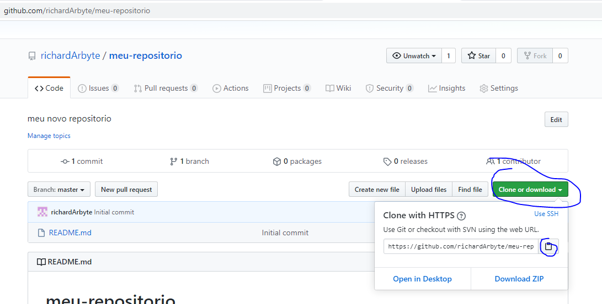

# CLONANDO SEU REPOSITÓRIO

Após copiar esse link, vamos clonar ele para nossa maquina agora.

1 - Primeiro, na sua área de trabalho, crie uma pasta vazia chamada "estudos".

2 - vá até a pasta "estudos" e clique na barra de pesquisa dela, para copiar o endereço dela.

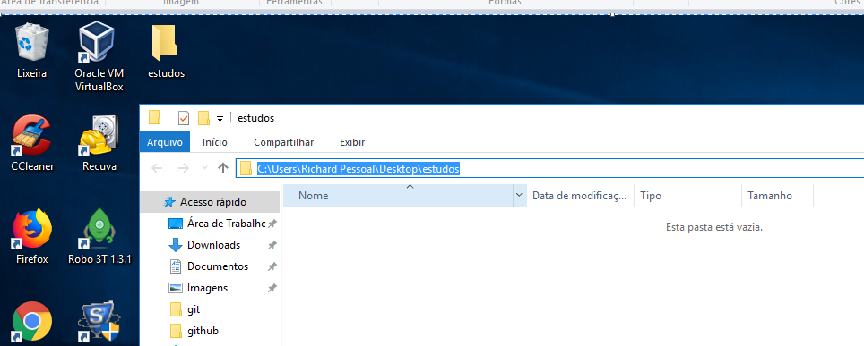

3 - Copie esse endereço com "crtl+c" ou botão direito, copiar, abra seu terminal (CMD) e digite `cd + link da pasta copiado`, em seguida aperte ENTER.

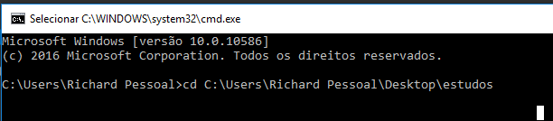

Observe que ao digitar esse comando e apertar enter, seu terminal navegou até esse terminal do seu computador.

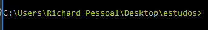

4 - Pronto, estamos dentro da nossa pasta de estudos, agora voltamos ao github e copiamos aquele link novamente.

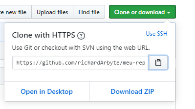

5 - Voltamos ao terminal, dentro da pasta "estudos" e digitamos `git clone + link copiado do github`.

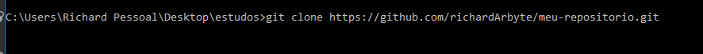

Ao final, ele nos retornará essa mensagem se tudo ocorrer certo.

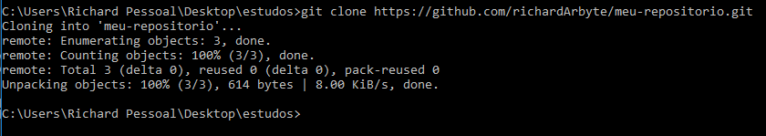

Lembrando que para alguns o github pode solicitar usuário e senha, basta digitar se necessário e o resultado deve ser o mesmo.

Se digitarmos `dir` no terminal, vamos ver que nosso repositório foi clonado, mas que ainda não estamos dentro dele.

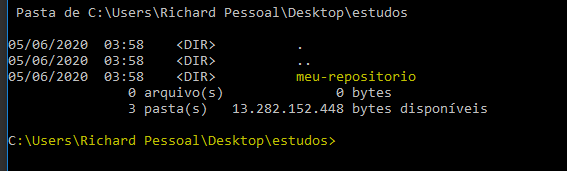

Basta digitar `cd nome-do-repositorio` e pronto, estaremos dentro do nosso repositório criado.


# CRIANDO REPOSITÓRIO PELO TERMINAL

Vimos como é simples criar um repositório pelo github e clonar na nossa maquina, mas se quisermos criar ele da nossa maquina e mandar para um repositório remoto, tambem é possivel e é tão simples quanto, bora lá.

1 - Antes de tudo, volte na aba de repositórios do github, crie um repositório vazio (repositórios > new ) e guarde esse endereço `HTTPS` gerado mais para frente.


2 - Agora na área de trabalho/Desktop do seu computador, dentro da pasta "estudos", crie uma pasta nova com o nome do seu repositório. 

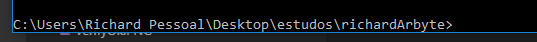

3 - Navegue até essa pasta criada pelo terminal, assim como fizemos antes. Em seguida digite `git init` e aperte ENTER.

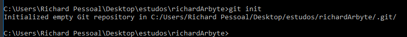

Caso tenha aparecido esta mensagem `Initialized empty Git repository....` no seu terminal, deu tudo certo.

4 - Agora que temos nosso repositório iniciado local, vamos digitar `code .` para abrir o VSCODE.

5 - Dentro do vscode, crie um novo arquivo chamado `index.html`.

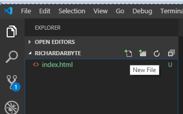

Dentro desse index, criei algum código html, por exemplo:

```
<!DOCTYPE html>
<html lang="en">
<head>
    <meta charset="UTF-8">
    <meta name="viewport" content="width=device-width, initial-scale=1.0">
    <meta http-equiv="X-UA-Compatible" content="ie=edge">
    <title>Document</title>
</head>
<body>
    <h1>MEU PRIMEIRO SITE UHUULLLLL</h1>
</body>
</html>
```

6- Após salvar esse arquivo, volte ao terminal (ou utilize o terminal integrado do vscode) e digite `git add .`


Aperte ENTER, em seguida digite `git status`. Se tudo deu certo, deve aparecer uma mensagem assim:


7 - Agora digite `git commit -m "alguma mensagem que diga para as pessas o que seu commit esta fazendo"` em seguida, ENTER.

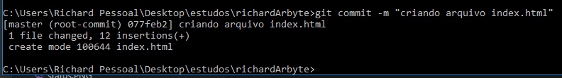

8 - Agora vamos fazer os pushs desse repositório para nosso endereço remoto que já está no github, digite `git remote add origin https://github.com/username/repositorio.git` substituindo o `username` pelo seu nome de usuário do github e o `repositorio` pelo nome do repositorio que haviamos criado no **passo 1**.

No meu caso ficará assim `git remote add origin https://github.com/richardArbyte/richardArbyte.git`

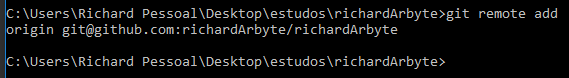

8 - Em seguida vamos rodar o comando `git push -u origin master`

Se não estiver logado no github, irá aparecer a janela abaixo, basta prosseguir inserindo seu username e senha.

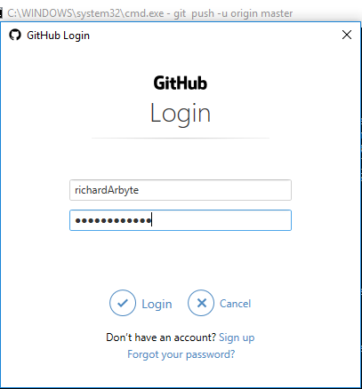

Por fim, se tudo deu certo, a mensagem a seguir será printada no seu terminal.

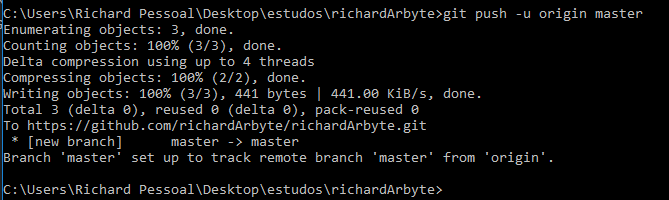


Pronto, agora sabemos criar um repositório local e enviar para um repositório remoto. 

Achou algo faltando aqui? Abre um PR e ajude a manter essa documentação viva :)